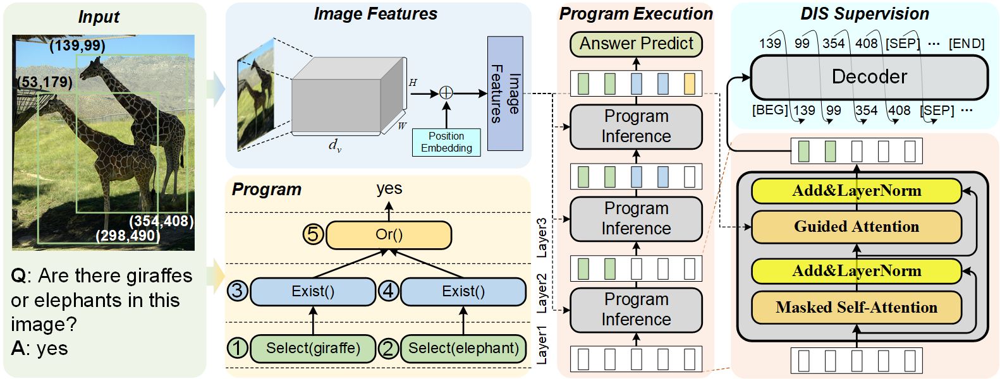

# ReadMe

This code contains the implementation of the AAAI24 paper titled ''[Detection-Based Intermediate Supervision for Visual Question Answering](https://arxiv.org/pdf/2312.16012.pdf)'', and gives detailed execution steps for re-implement. In addition, we also provide pre-trained models to facilitate reimplementation.

## Abstract

According to the framework of DIS as follows, the re-implementation can be divided into several steps:



+ **Image Feature Generation**: Generate feature maps from GQA images using pre-trained Faster R-CNN backbone. The details can be found in [facebookresearch/grid-feats-vqa](https://github.com/facebookresearch/grid-feats-vqa).

+ **Program Generation**: Generate programs from questions using T5-based model. In this step, we need to construct *question-to-program* dataset to finetune T5 model, so that the pre-trained model can be used for program generation on *test-split* or *submission-split* of GQA dataset. Therefore, this step be further be divided into following sub-steps:
  + **Question-to-program Dataset Construction**: Construct (question, program) pairs from *train-split* and *val-split* of GQA dataset.
  + **T5 Finetuning**: Finetune T5-based model using abovementioned dataset.
  + **Program Generation**: Use the finetuned T5 model to generate programs for *train/val/testdev/submission-split* of GQA dataset.
+ **Program Execution**: Train VQA models based on abovementioned visual features and program structures. In this step, there are two strategies to train the VQA model according to **whether using *all-split* for bootstrapping**:
  + **No use of *all-split***: Train VQA model on *train-split*+*val-split*, and evaluate on *testdev-split*.
  + **Use of all-split**: Firstly, VQA model is trained on *trainall-split+valall-split*, and then finetuned on *train-split*+*val-split*, and finally evaluate on *testdev-split*.

+ **DIS Supervision**: Traditional VQA methods optimize the model using answer classification loss, *i.e.* cross-entropy loss.  We further design DIS loss to supervise the models' intermediate states, facilitating visual grounding and logical reasoning. Specifically, this step is divided into several sub-setps:
  + **Intermediate Result Generation**: In the training phase, we generate the intermediate results to supervise the VQA model using the ground-truth scene graphs provided by GQA dataset.
  + **Generation Loss**: The intermediate results (*e.g.* bounding boxes, object names, *etc.*) are converted into sequences, and an auto-regression loss is designed to make VQA model generate such sequences.

## Preliminary

### Dataset

+ **Step1**: Download GQA dataset from the official website: [GQA: Visual Reasoning in the Real World (stanford.edu)](https://cs.stanford.edu/people/dorarad/gqa/download.html)

+ **Step2**: Organize GQA dataset into the following form:

  ```
  |- data/
  	|- questions/
  		|- train_balanced_questions.json
  		|- train_all_questions/
  			|- train_all_questions_[0|1|2|3|4|5|6|7|8|9].json
  		|- val_balanced_questions.json
  		|- val_all_questions.json
  		|- testdev_balanced_questions.json
  		|- testdev_all_questions.json
  		|- test_balanced_questions.json
  		|- test_all_questions.json
  		|- submission_all_questions.json
  	|- sceneGraphs/
  		|- train_sceneGraphs.json
  		|- val_sceneGraphs.json
  	|- images/
  		|- 1000.jpg
  		|- 1001.jpg
  		|- 1002.jpg
  		|- ...
  ```

### Environment

+ **Base environment**:
  + Python 3.7
  + torch 1.10.0
  + torchvision 0.11.0
  + nltk 3.8.1
+ **Third-party environment**:
  + detectron2 0.1.1
  + transformers 4.27.4

## Image Feature Generation

We exploit pre-trained Faster R-CNN backbone to extract feature maps from GQA images, and use average pooling to downsample the feature map to the size of $10\times{10}$.

+ **Step1**: Clone [grid-feats-vqa](https://github.com/facebookresearch/grid-feats-vqa) and [detectron2](https://github.com/facebookresearch/detectron2) in `grid_feat` directory:

  ```bash
  $ cd grid_feat
  $ git clone https://github.com/facebookresearch/grid-feats-vqa
  $ git clone https://github.com/facebookresearch/detectron2
  ```

+ **Step2**: Install detectron2 from source:

  ```bash
  $ cd detectron2
  $ git reset --hard ffff8acc35ea88ad1cb1806ab0f00b4c1c5dbfd9
  $ cd ..
  $ python -m pip install -e detectron2
  ```

+ **Step3**: Download X-152 model checkpoints to `ckpts` directory:

  ```bash
  $ mkdir ckpts
  $ cd ckpts
  $ wget https://dl.fbaipublicfiles.com/grid-feats-vqa/X-152/X-152.pth
  ```

+ **Step4**: Extract image features

  ```bash
  $ bash extract_gqa.sh
  ```

Finally, the extracted feature maps will be saved in `data/gqa_grid_152_10_10`.

## Program Generation

### Question-to-program dataset construction

+ **Step1**: Construct question-to-program dataset from *trainall-split* of GQA dataset:

  ```bash
  $ python scripts/preprocess.py --process trainval_all --question_dir "data/questions" --output_dir "data/preprocess"
  $ python scripts/preprocess.py --process create_balanced_programs --question_dir "data/questions" --output_dir "data/preprocess"
  $ python ques2prog/generate_program_t5.py --do_preprocess --data_dir "data/preprocess" --output "data/question2program"
  ```

+ **Step2**: Train T5-based model on *trainall-split* for program generation, only 1 epoch is enough. The trained model will be saved in `models` directory:

  ```bash
  $ python ques2prog/generate_program_t5.py --do_train --data_dir "data/question2program" --batch_size 16 --max_epoch 10
  ```

+ **Step3**:  Using the trained T5 model to generate programs for *train/val/testdev/submission-split*:

  ```bash
  $ python ques2prog/generate_program_t5.py --do_trainval_prog --load_from "models/seq2seq_ep0.pt" --data_dir "data/preprocess" --save_dir "data/gqa_program_t5"
  $ python ques2prog/generate_program_t5.py --do_testdev_prog --load_from "models/seq2seq_ep0.pt" --data_dir "data/preprocess" --save_dir "data/gqa_program_t5"
  $ python ques2prog/generate_program_t5.py --do_submicd gqa	ssion_prog --load_from "models/seq2seq_ep0.pt" --data_dir "data/questions" --save_dir "data/gqa_program_t5"
  ```

## DIS Supervision

Previous methods only exploit the final answer for supervision, while DIS uses intermediate results to supervise the model. In this step, we will use the ground-truth scene graphs and above-generated programs to obtain the intermediate results for the programs. Use following command lines:

```bash
$ python scripts/trace_sg.py --sg_dir data/sceneGraphs --data_path data/gqa_program_t5 --do_trainval
$ python scripts/trace_sg.py --sg_dir data/sceneGraphs --data_path data/gqa_program_t5 --do_testdev
$ python scripts/trace_sg.py --sg_dir data/sceneGraphs --data_path data/gqa_program_t5 --do_submission
```

## Program Execution

+ **Step1**: Use following command line to train DIS model:

  ```bash
  $ bash train_vqa_e2e.sh
  ```

+ **Step2**: Use following command line to generate answers for *submission-split*: 

  ```bash
  $ bash submit_vqa_e2e.sh
  ```

## Code

We release all the code and data on [Baidu Yun](https://pan.baidu.com/s/1YN8mWttA9Tv6tiaqk1OF1Q?pwd=8888) and [Google Drive](https://drive.google.com/drive/folders/1EObQGVrDVgnXgy7pui7lGVM-nvO5n4jR?usp=sharing).

Due to the large file sizes, we split the data into splits. To recover and unzip the data, use following command line:

```bash
$ cat x* > code.tar.gz
$ tar xzvf code.tar.gz
```

## Online Test

+ [Dev](https://evalai.s3.amazonaws.com/media/submission_files/submission_261928/12ce6a9d-2a93-4712-a5e8-8a51b4d6d3bb.json)

+ [Test](https://evalai.s3.amazonaws.com/media/submission_files/submission_262794/883481bf-f78e-4e53-ba67-388afbe5aa39.json)

## Citation

If you found this code is useful, please cite the following paper:

```
@article{liu2023detection,
  title={Detection-based Intermediate Supervision for Visual Question Answering},
  author={Yuhang Liu and Daowan Peng and Wei Wei and Yuanyuan Fu and Wenfeng Xie and Dangyang Chen},
  journal={ArXiv},
  year={2023},
  volume={abs/2312.16012},
}
```

## Acknowledgements

+ Our code is based on the MMN, and we are grateful for their excellent work! ["Meta Module Network for Compositional Visual Reasoning", WACV, 2021. (github.com) ](https://github.com/wenhuchen/Meta-Module-Network)

